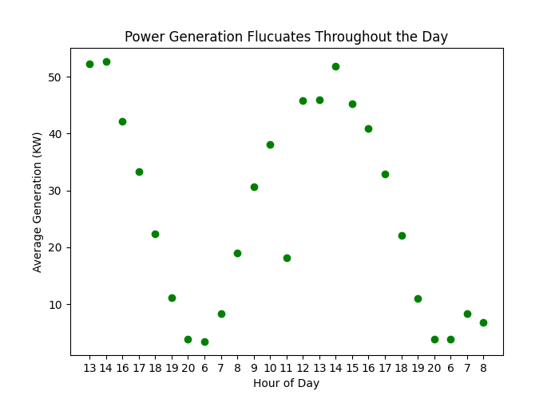
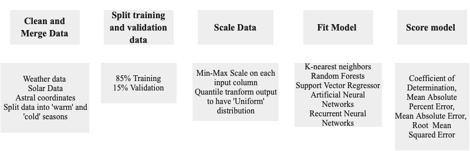
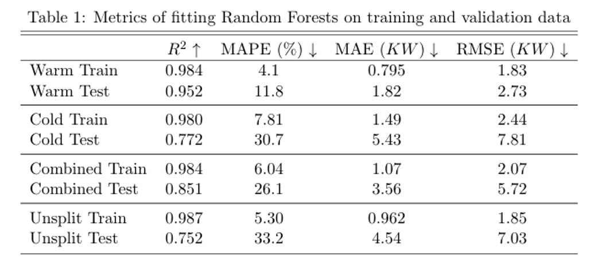

# Solar Energy Forecasting
For Paper detailing this work see <a href="https://www.overleaf.com/read/nybprsncxpxf" > Paper </a>

For powerpoint presentations see: <a href="https://github.com/bradley-p/Solar_Energy_Forecasting/blob/main/Reports:Notes/" >Reports Folder </a>

## Problem Statement: 

### Given

Historical weather data from USU Climate Center that contains 33 input variables including temperature, pressure, precipitation, clear sky radiation, humidity, etc.

Azimuth and Zenith angle of sun at each hour

Month and day of year encoded as coordinates

Solar Production data

### Find 

Average energy generated (KW) in the next hour, using data from 100 KW grid from Aspire labs for fitting

## Motivation: 
There is a need to transition to green energy to prevent and reverse global climate change. Solar energy sources are a way to supplement energy needs in a clean way. The issue with solar energy is that energy production is dependent on weather conditions and varies throughout the day. If we can predict how much solar energy will be produced, we can modify the traditional power plants to accommodate the fluctuations in solar power. By producing less traditional energy during peak solar hours, we can reduce carbon emissions.
## Data:
The energy production of the solar panels maintained by Aspire labs is constantly monitored. They began collecting data in July 2019 and have provided me that data for this project. 

The USU climate center keeps a detailed record of historically observed weather and is publicaly available. The input data was also supplemented by the Azimuth and Elevation angles of the sun at each timestep. These angles were calculated using the <a href='https://github.com/bradley-p/Solar_Energy_Forecasting/tree/main/src'>Astral</a> package 

## Methods:
A variety of Machine learning approaches have been applied. The results can be replicated using the files in the  <a href='https://github.com/bradley-p/Solar_Energy_Forecasting/tree/main/src'> src</a> folder

## Results: 
Random forests performed best on training and validation data on every experiment with this dataset. 

Splitting the model into seasons helped model have better generalization results.

Table 1 shows a summary of error using Random Forests.

